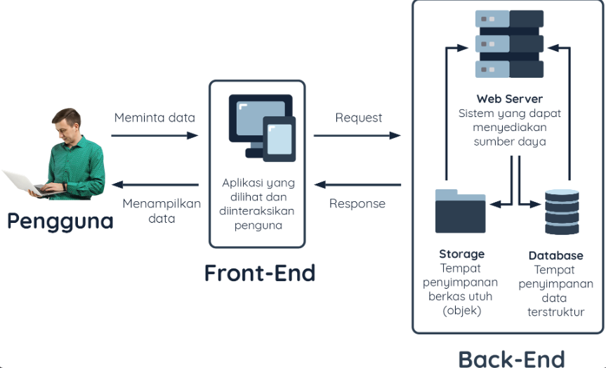

# Server

## 🏛️ Pengantar

Meskipun **Back-End** dan **Front-End** memiliki peran dan fokus yang berbeda, keduanya harus saling terhubung secara lancar (seamless) agar aplikasi dapat berjalan dengan baik. Kembali ke analogi kedai kopi, ketika Anda memesan kopi tubruk di kasir, bagaimana informasi tersebut bisa sampai ke barista? Lalu bagaimana caranya kopi yang sudah dibuat barista sampai ke meja Anda? Pasti ada perantara mengapa semuanya saling terhubung. Pada kedai kopi, penghubung itu adalah seorang **pelayan**.

Pelayan mencatat pesanan yang Anda inginkan, kemudian mengirimnya ke barista. Setelah barista selesai membuat kopi, pelayan juga yang mengantarkan kopi dari barista ke meja Anda. Semua transaksi yang terjadi menggunakan perantara. Sebagai pelanggan, Anda tidak bisa masuk ke dapur dan meminta kopi secara langsung ke barista, karena hal tersebut menyalahi prosedur.

Begitu pula dengan transaksi yang terjadi pada sistem aplikasi. Kita harus merancang sistem aplikasi dengan prosedur yang benar. Transaksi yang dilakukan **Back-End** ke **Front-End** harus melalui perantara. **Front-End** tidak boleh memiliki akses langsung terhadap **database**, begitu pula dengan **Back-End** yang sama sekali tidak boleh diakses secara langsung oleh pengguna (end-user). Pada sistem aplikasi, perantara tersebut dinamakan **"server"**, yang posisinya serupa dengan pelayan di kedai kopi.

---

## 🌐 Apa Itu Server?

Server merupakan sebuah sistem yang dapat menyediakan sumber daya berupa data, layanan, atau program untuk disajikan ke komputer lain[[1]]. **Ingat!** Pengertian dari server bukanlah sebuah perangkat keras ataupun komputer, melainkan lebih merujuk kepada sistem yang dapat membuat perangkat (termasuk komputer) melayani sebuah permintaan dari perangkat lain. Jika diterjemahkan ke dalam Bahasa Indonesia, server memang berarti **penyaji** atau **pelayan**.

Server bertugas untuk melayani layanan (services) atau jasa. Dalam dunia komputer, ada banyak jenis layanan yang dapat dilayani oleh server. Berikut beberapa tipe server sesuai dengan layanan yang perlu Anda ketahui:

### 1. **File Server**
Melayani penyimpanan dan pendistribusian berkas. File Server memungkinkan pengguna untuk menyimpan, membagikan, dan mengakses file dari lokasi yang sama.

### 2. **Application Server**
Melayani hosting sebuah program atau aplikasi. Application Server bertugas untuk menjalankan aplikasi dan mengelola logika bisnis di balik aplikasi tersebut.

### 3. **DNS Server**
Mengubah nama domain (contoh: `dicoding.com`) ke dalam bentuk IP Address (contoh: `75.2.21.170`). DNS Server memungkinkan pengguna untuk mengakses situs web dengan nama domain yang mudah diingat.

### 4. **Web Server**
Melayani hosting sebuah program atau aplikasi (seperti Application Server) yang dapat diakses oleh client melalui internet maupun intranet. Web Server adalah salah satu jenis server yang paling umum digunakan dalam pengembangan aplikasi web.

### 5. **Database Server**
Melayani penyimpanan dan pendistribusian data terstruktur. Database Server bertugas untuk menyimpan, mengelola, dan memproses data yang dibutuhkan oleh aplikasi.

---

## 🚀 Fokus pada Web Server

Sebenarnya masih banyak lagi tipe server yang tidak disebutkan, namun Anda tidak perlu mengetahui semuanya saat ini. Ada satu tipe server yang perlu kita fokuskan sekarang, yakni **Web Server**. Web Server adalah perantara yang memungkinkan komunikasi antara **Front-End** dan **Back-End** dalam aplikasi web. Web Server bertugas untuk menerima permintaan dari browser pengguna, mengambil data yang diperlukan dari **Back-End**, dan mengirimkan hasilnya ke browser pengguna.

Dalam analogi kedai kopi, Web Server berperan sebagai **pelayan** yang menghubungkan **kasir (Front-End)** dengan **barista (Back-End)**. Tanpa Web Server, aplikasi web tidak akan dapat berfungsi dengan baik, karena komunikasi antara **Front-End** dan **Back-End** akan terputus.
